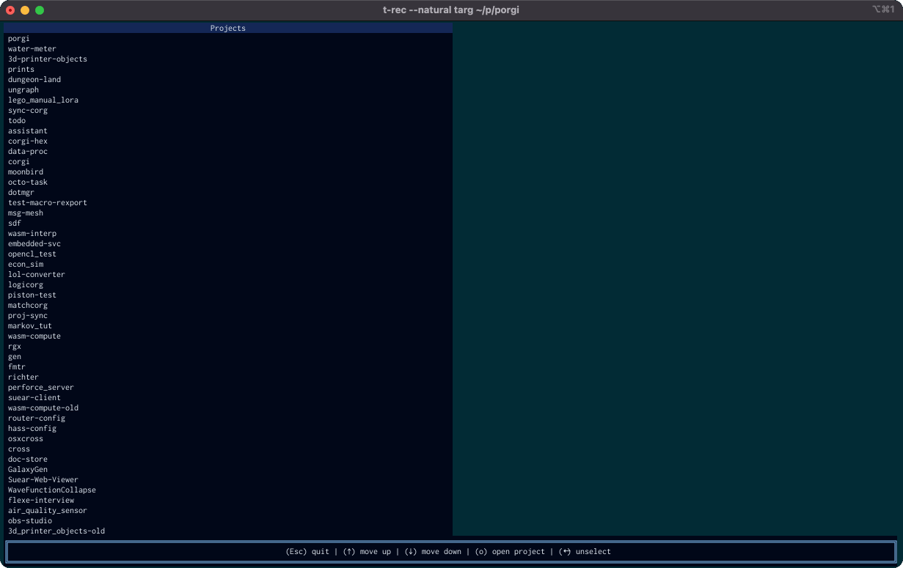

# Porgi 🐾

A corgi to organize and find your projects, a porgi.

Probably don't use this yet since its very much a WIP.



If you are like me you probably have some directory on computer brimming with hopes, dreams, and build files called "projects". If you often find yourself scratching your head and forgetting where put that very important weird cli tool that you now can't live with out (perhaps because you name everything corgi) this tool is for you.

## Configuring your porgi

*Porgi require a config file to run for now*

Add the following to `~/.config/porgi/porgi.toml`

```toml
# Add your project directories here
project_dirs = ["~/projects"]

# Set the editor or IDE you (o) will use to open the project
#
# Options:
# - "auto" (default): Use the first working opener
# - "code": Use Visual Studio Code
# - "editor": Use the EDITOR environment variable
# - "config": Use custom command (WIP)
opener = "auto"
```

## Features

- [x] Multiple project directories
- [x] Sort projects by most recent changes
- [ ] Open in editor (WIP)
- [ ] New user onboarding (TBD if this will be in TUI)
- [ ] Preview of file tree
- [ ] Stats for project such as file count, lines of code etc...
- [ ] Cleaning old build files and projects
- [ ] Checking projects are up to date in git

## Other project finding tools

[projects-cli](https://github.com/webdesserts/projects-cli/tree/master)